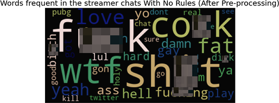

# DATABITS Project

## Effectiveness of Twitch Chat Rules

## Dataset
  Twitch is one of the most popular live streaming platforms on the market today. Created by Justin Kan and Emmett Sheer on 2007, Twicth has been the avenue where content creators share their experiences with an audience and interact with them in real time. However, with the rise of usage comes with implementation of rules and regulations to manage all the users that Twitch has in its platform. The rules includes but not limited to the following:
  - Limitation of contents posted in their platform (Disallowing content creators to post sexual and obscene contents)
  - Prohibitation of using hateful speech and harassment towards other people and content creators
  - Insuing threats upon other users and Wrongfully impersonating someone
  - Banning unauthorized sharing of private information in chat or in streams

  With all of the rules in place, Twitch has been able to control and monitor all of its users in their platform. However, as the plaform gains more users over time during the pandemic, it became harder to monitor every user in the platform. As such, Twitch has provided content creators the option to impose and enforce their own rules in their channel to prevent other people abusing the slow response time of Twitch admins and mods to harrass other users and violate Twitch policy. As such, this project aims to identify if imposing rules and strictly enforcing them throughout a certain period of time can in fact improve the overall behavior of the community of the streamer.

  As such, the dataset collected for this project was from the popular category of Twitch ever since people are confined in their homes due to the pandemic, gaming. The data was from a total of 8 popular streamers, 4 of which implments chat rules and 4 who does not. These chat rules can be seen in the respective streamer's about page and it also appears when user are about to chat for the very first time during a streamer is live. The streamers who imposes rules for their community are as follows: Ninja, TimTheTatMan, MOONMOON, and GeekandSundry. Those who does not implement chat rules are: Shroud, DrLupo, Summit1g, and Lirik. Additionally, we will be using a tool called the "Hate Sonar" developed by Hiroki Makayama, which is a library in Python that detects if a line of text provided is considered as toxic or not. 

  The dataset that we collected contains the lines of the users that are typed during the livestreams of the mentioned streamers which is then classified into groups containing 4 other columns which represents if the data is considered toxic or not. These columns are as follows:
  - top_class - this contains a string value of the highest classification in the hate sonar which can classify if a line of text is  considered as hate speech or not
  - hate_speech - this contains a float value which the hate sonar classifies the text as hate speech
  - offensive_language - this contains a float value which the hate sonar classifies the text as an offensive language
  - neither - this contains a float value which the hate sonar classifies the text as containing neither hate nor offensive language

   As the datasets were loaded into a table, the columns hate_speech, offensive_language, and neither were removed because these are unnecesary columns for this study. For the top_class column, we decided to create another column called toxic, which is a binary representation of whether the text is not toxic (0) or toxic (1). Below is a sample table after doing these steps.

  The texts were then processed to prevent other inconsistencies in the data. As such, the data is transformed to lower case (to avoid repetition), stripped of potential stopwords (to remove unnecessary words that do not provide meaning to the text), emotes (which provides no context to the hate sonar as it has no meaning out of context) and the streamer name (to prevent bias). After doing this, the words are then placed inside a table with their respective number of occurence. Below is a sample table after all the processing.

## For Streamers With No Rules
For streamers with no rules, the group was able to gather 1,873,772 chat lines worth of data to analyze and process.

#### No Pre-processing

### After Pre-processing

  For before and after pre-processing, we could see a drastic improvement of the chats collected. This will help the system recognize which of the lines of chat is considered to be toxic or not without any outliers in the data.

### Top 50 words

  The figure above shows the top 50 words that are frequent in the chats of streamers without rules. We can see that there are a lot of curse words used during the livestream such as f\*ck, sh\*t and wtf. We can also see a lot of derogatory and inaapropriate words such as fat, c\*ck, ass, gay, h\*ll, and d\*ck. These words appear very often as there was no rules regulating how the community needs to behave during the stream. Additionally, the streamer does not care and does not monitor the chat to prevent the users from using toxic languages. This resulted in a more hate-oriented behavior of the community which reflects upon the style and the tone of the stream.

## For Streamers With Rules
For streamers with rules, the group was able to gather 1,311,976 chat lines.

#### No Pre-processing

### After Pre-processing

  After processing the data, the data became better to analyze due to the lack of unnecessary data to comb through. Additionally, we could also see that the amount of words significantly lowered. However, during the processing phase, the word *bidet* stood out so the group searched why people are chatting this. It turns out that the word bidet, acoording to a reddit post[1] is a misspronounced "good day", which then became a meme-like chat during another streamer's livestream when they go online.

[1]. https://www.reddit.com/r/criticalrole/comments/dg8h58/no_spoilers_can_someone_explain_bidet_to_me/

### Top 50 words

  As compared to the chat of the streamers with no rules, the chat of the streamers with rules contains less frequent toxic chats. However, these chats still appear during livestreams from time to time these can be avoided by heavy enforcement of rules by moderators and admins. The streams of these content creators with rules is themed to be more of a mellow and a better overall environment for other people to join in and have fun. The streamers also promoted better and more supportive communities that would encourage more people to join in.

## Merged Data

### Frequent in both rules and without rules chat

### Top 50 words in both rules and without rules chat comparison

  
  When we merge all the data together, we can see that the top 5 words are the curse words, derogatory words and innapropriate words. Chat with rules and chat without rules have the same toxic words that appear on the chat. However, the frequency of these words appearing in chats of streamers with rules are significantly reduced as the rules were enforced heavily by the streamer's moderators and admins and the chat of the streamers without rules have toxic words appearing more frequent as chat is not monitored for toxicity during the livestreams.

### Conclusion
  
  In this data project, the goal is to know wheter having chat rules in Twitch livestream chats in the Gaming genre. Based on the gathered data, streamers who implements chat rules and those who does not, encounters the same toxic words such as f\*ck, sh\*t, wtf, c\*ck, h\*ll, b\*tch and many more. However, the quantity of toxic words in the streamer's chat would recieve varies a lot. When comparing chat with rules and without rules, the frequency of toxic words a streamer receives for chat without rules are signicantly higher which results in a more toxic and more over the top stream themes. With that, we can conclude that imposing chat rules is beneficial to impose a better and safer environment of the community and improve the overall stream vibes. As such, based on the initial findings, we recommend streamers to implement and enforce chat rules to lessen the amount of toxicity present in their chat.
